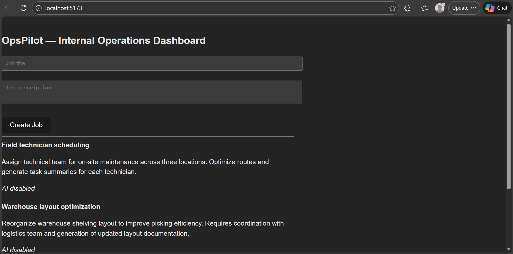

# OpsPilot — AI-Powered Internal Operations Dashboard



Small full-stack MVP demonstrating internal tools + automation + AI-assisted workflows.

Built to showcase rapid MVP → production thinking.

---

## Features

- React frontend dashboard
- Node.js + Express backend
- PostgreSQL database
- Job creation + listing
- GPT-powered job summary generation (optional)
- Automation-ready backend
- Dockerized Postgres

---

## Tech Stack

- Frontend: React + Vite
- Backend: Node.js, Express
- Database: PostgreSQL
- AI: OpenAI (optional)
- DevTools: Docker

---

## Architecture

Frontend → Backend API → PostgreSQL  
Backend → OpenAI (if API key provided)

---

## Running locally

### Start Postgres

```bash
docker run -d -p 5432:5432 -e POSTGRES_PASSWORD=postgres -e POSTGRES_DB=opspilot --name opspilot-db postgres:15
```

---

## Why this project

Built in ~1 day as a rapid MVP to demonstrate automation-first, AI-ready internal tooling.

Inspired by real-world telecom operations and internal tooling experience.
Goal: reduce manual work using automation and GenAI.

